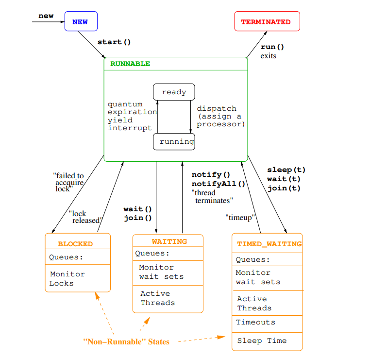
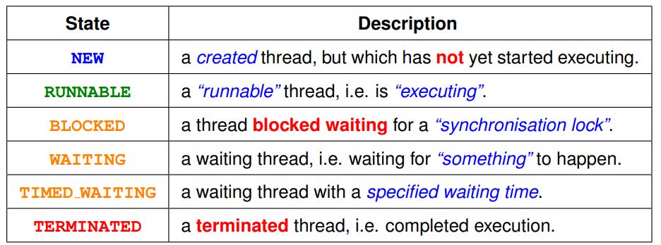
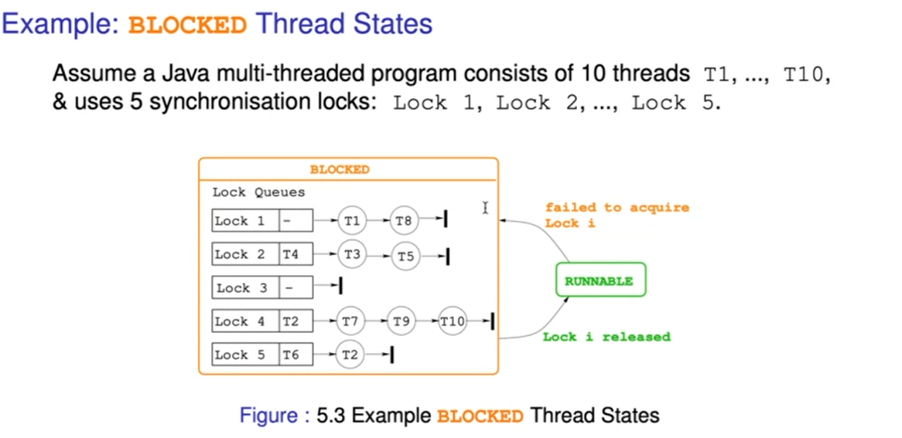

# Learn_ConcurrentProgramming
Learn Concurrent Programming Concepts and Create Multi threaded applications

**1. Thread life cycle and states**

For each lock there is separate queue, if 5 locks then 5 queue

**Thread scheduling** 
concurrent programming can be categorized under two category based on the number of core
that a machine has: 

1.Real concurrent ==> where there are multiple core (multicore processor) where each thread will get executed truly simultaneously in different core or multiple processor each of the thread can executed in different processor
in that case also it is truly concurrent 

* Actually thread is not designed for multicore processor or multiple processor, it is designed for single core processor. 

2.Pseudo (fake) concurrent programming ==> there are multiple thread wanted to get executed but there is only single core => that's mean at any given time only one thread can get executed => then how can called it is a concurrent programming , this is time slicing (Quantum) comes in to play 

Why do we need thread scheduling ? - 
What is thread scheduling?  - giving a thread quantum of the processor(time slice) to get executed

We can not do any assumption using the priority , the order of the execution of thread, and we can not program. We should always assume this thread are executed simultaneously. 

